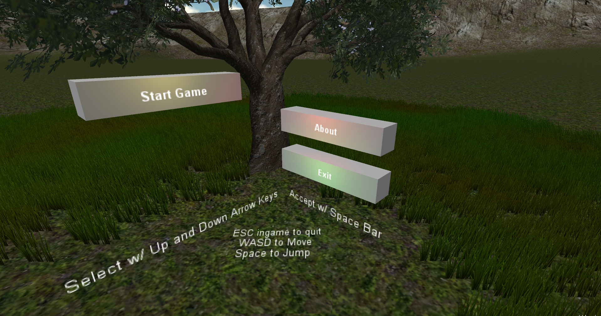
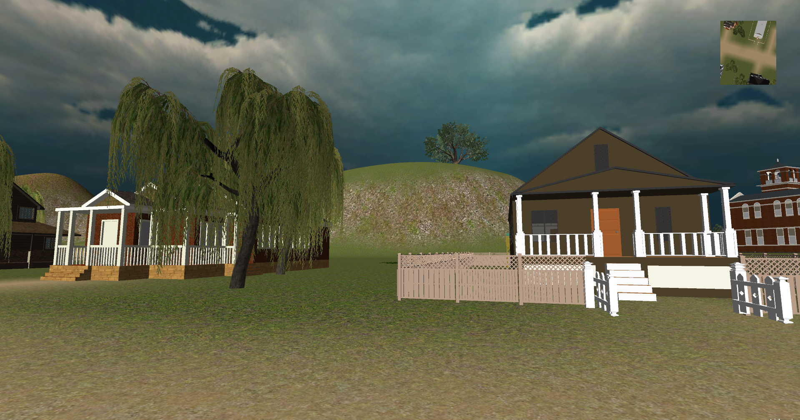
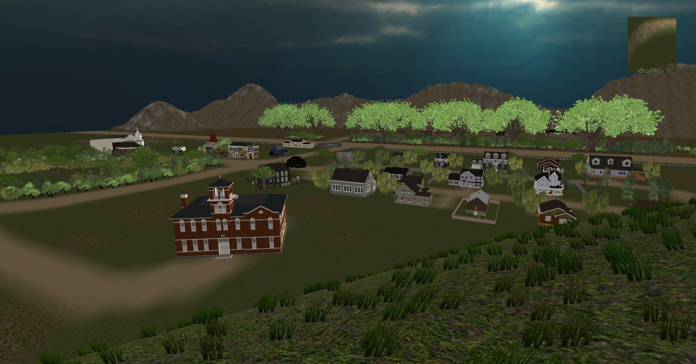
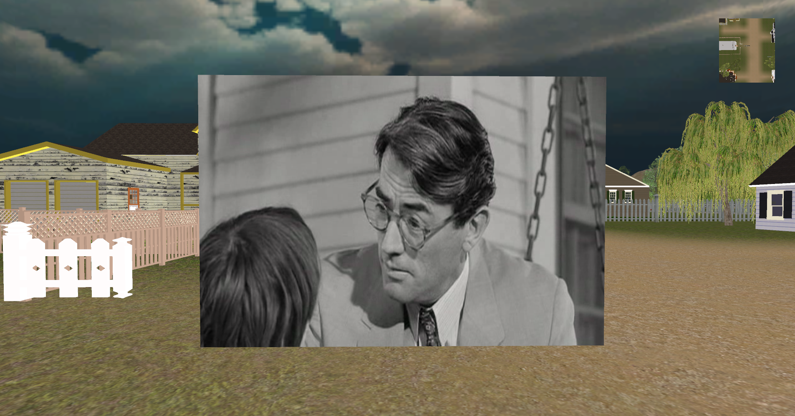

# To Kill A Mockingbird (Book) - The Game

This was a simple project requested by my old high school professor to represent 'setting' in the book - To Kill a Mockingbird.

### Features

	
	* A fully decorated (to scale) map of the setting as described in the book.
		* Contains all key buildings (with decorated interiors)

	
	* Adjustable minimap.

	
	* Boxes that expand into large tv screens to show certain scenes that happened in specific locations in the movie.
		* These boxes are placed all around key areas